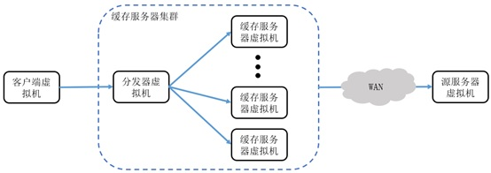

# Web Cache Prototype

This project is forked from [dasebe/webtracereplay](https://github.com/dasebe/webtracereplay), [Daniel S. Berger](https://www.cs.cmu.edu/~dberger1/)

This project provides simple tools to replay http request trace files to evaluate the performance of caching systems and webservers. Can be used to evaluate CDN system. 

There are three components:

 - the client: which reads in the trace file line by line, and generates valid http requests in a multithread way
 - the server: the cache proxy server which you are trying to benchmark, e.g., nginx, Varnish, Apache TS, etc. And your own cache policy.
 - the origin: which emulates a database or storage server, the backend server be cached by proxy server

### 客户端虚拟机
模拟了内容分发网络节点接收到互联网中大量的网络内容请求。客户端虚拟机
主线程快速的读取存储在本地磁盘上的记录真实请求序列的文件，主线程作为生
产者-消费者模型中的生产者将解析好的请求放入等待队列中。并发出多个子线
程作为消费者不断读取等待队列中的请求，通过 `curl` 向代理服务器发送内容请
求。

### 代理服务器
（对客户端而言是代理服务器，但是对集群内部而言是分发器）相当于节点部分的分发器，在上面运行分发算法，把收到来自客户端的请求进一步分发到缓存服务器上。缓存服务器集群由多个虚拟机组成，每个虚拟机上运行`nginx`来真正提供缓存内容服务。

### 源服务器虚拟机
来模拟使用内容分发网络服务的内容供应商源服务器，对于缓存不命中的请求，缓存服务器向源服务器请求得到内容再返回用户。由于内容数量过多，源服务器不可能存储这么多不同的真实的文件。在实现过程中考虑到这一点，源服务器并发多线程通过 `spawn-fcgi` 管理 `fast-cgi` 进程监听`cgi`请求。由于整个请求序列里不同内容的源文件总大小可能大至TB级别，源服务器磁盘上保存原内容并按需传输在实现上有难度，于是子线程接受到请求后，在返回报文中的数据字段里填充对应文件大小的数据块（使在传输内容大小的报文，至于发送内容是不是真实的文件内容不重要）。

## Experiment Set Up

Experiment works on Ubuntu 18.04

Please install

 - curl ===> `sudo apt-get install libcurl4-openssl-dev`
 - fgci ===> `sudo apt-get install libfcgi-dev`
 - spawn-fcgi  ===>  `sudo apt install spawn-fcgi`
 - `gcc` with a version > 5.0, ideally 6.0+

There are Makefiles for the client and origin:

    cd client
    make
    cd ..

    cd origin
    make

Also compile and install a webserver/caching system, such as nginx. The example config in the server subfolder assumes we are using nginx. You can either point nginx to use the configuration file server/nginx.conf or copy the directory to /usr/share/nginx .

## Request traces

We will need request traces for the client (to request objects) and the origin (to emulate objects).

### Client request trace

Request traces must be given in a space-separated format with three colums
- time is an unisgned int; not used currently, but can be used to schedule the replay
- url/key should be a long long int, used to uniquely identify web objects

| time |  id |
| ---- | --- |
|   1  |  1  |
|   2  |  2  |
|   3  |  1  |
|   4  |  3  |
|   4  |  1 |

### Origin request trace

The origin request trace is simply a mapping of ids/urls to object sizes.

Request traces must be given in a space-separated format with two colums
- url/key should be a long long int, used to uniquely identify web objects
- size should be a long long int, this is the object's size in bytes

|  id | size |
| --- | ---- |
|  1  |  120 |
|  2  |   64 |
|  1  |  120 |
|  3  |  14  |
|  1 |  120 |

## Run an experiment

This example assumes you have nginx installed and everything set up.
The client request trace is called "client.tr" and the origin request trace is called "origin.tr".

We will need three VMs, or different terminals/screens on the same box.
Start these one after another.

#### Start nginx

    sudo nginx -c server/nginx.conf

#### Start the origin

    spawn-fcgi -a 127.0.0.1 -p 9000 -n origin/origin origin.tr

#### Start trace replaying and write throughput and delay measurements to through.log and histogram.log respectively

     client/client client.tr 20 127.0.0.1:7000 throughput.log histogram.log
